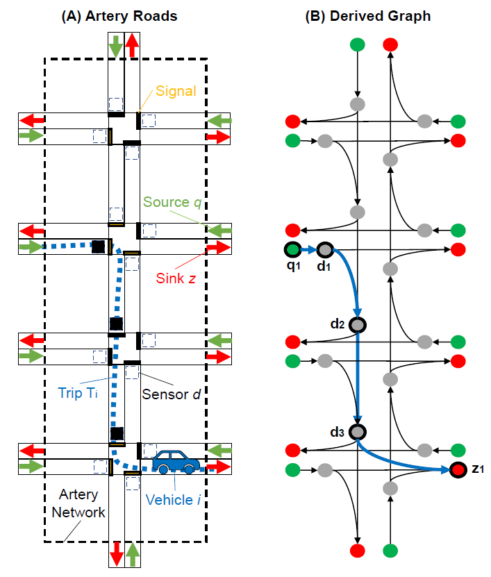
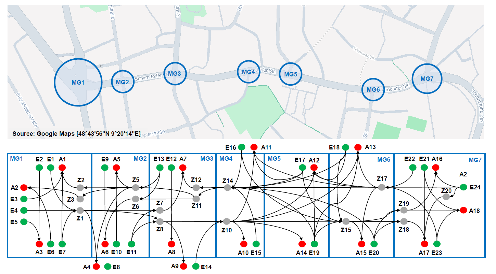
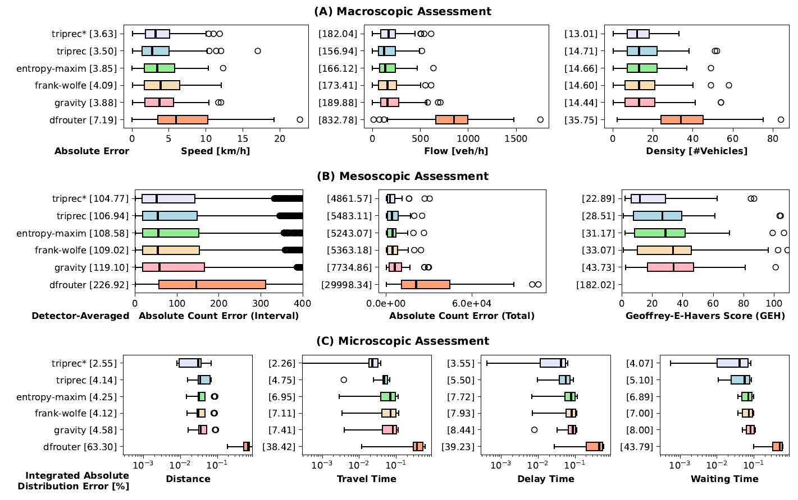

# Vehicle Trip Reconstruction Using Non-Aggregated, Timestamped, Loop-Detector Event Data

## Introduction
This is the online repository of **"Vehicle Trip Reconstruction Using Non-Aggregated, Timestamped, Loop-Detector Event Data"** (presented at the *9th Conference on Models and Technologies for Intelligent Transportation Systems (MT-ITS) 2025* in Luxembourg).
This repository contains a Python-implementation of the proposed trip reconstruction algorithm, and a traffic microsimulation.
The repository is based on [SUMO (provided by DLR)](https://eclipse.dev/sumo/).


## Abstract


<table>
<tr>
<td>
Loop-detectors count amongst the most adopted road sensing infrastructure.
An emerging use-case for this type of sensor data are digital twin models of cities and highways, that allow for real-time, simulation-based support in safety-critical decision-making of intelligent transportation systems.
While previous work used aggregated, counting data from loop-detectors for simulation calibration, the use of non-aggregated, timestamped, event data was overlooked.
This study proposes a method to reconstruct single trips from traces that vehicles leave passing a sensor and road network, which goes far beyond mere estimate probabilistic models of origins and destinations.
A case study of the arterial network Schorndorfer Strasse in Esslingen am Neckar (Germany) with 34 considered loop detectors and 96 traffic lights, demonstrates the feasibility of the approach.
An extensive benchmark with other methods shows, that simulations generated by the method achieve similar levels of accuracy on a macroscopic and mesoscopic level, while significantly improving accuracy on a microscopic level of up to 40%.
</td>
<td width=300>
</td>
</td>
</tr>
</table>






## What you will find in this repository

This repository contains the miroscopic traffic simulation model, data, and source code to reproduce the findings of our study.
The folder contain following information:

```
./
├── code/
│   ├── figures/...
│   └── pipeline/...
│       ├── module_trip_generator/...
│       ├── module_reconstruction/...
│       ├── module_od_estimation/...
│       └── module_df_router/...
├── figures/
│   └── ...
├── model/
│   ├── Configuration.sumocfg
│   ├── Network.net.xml
│   ├── Sensors.add.xml
│   ├── RunSimulation_df_router.py
│   ├── RunSimulation_od_methods.py
│   ├── RunSimulation_original.py
│   ├── RunSimulation_trip_reconstr.py
│   ├── demand/...
│   ├── signals/...
│   └── ...
├── logs/
│   ├── Emission_VehiclePopulation.xlsx
│   └── bus_schedule/
```


## Simulation Model
The microscopic traffic simulation model consists of 34 loop detectors and 96 traffic lights across seven intersections of the arterial network "Schorndorfer Strasse" in Esslingen am Neckar (Germany).
The code loads the traffic light signal states for each second from real data, and spawns traffic on the roads according to a realistic model "original" that was calibrated based on real-world loop-detector data.
Sensors are placed in the network to measure passing traffic and return timestamped event data (similar to the real sensor data we got from the city).

There are four versions of this simulation model, that allow the performance assessment of different methods to calibrate microsimulation models. They are described below:

|Model|Description|
|--|--|
|**original**|The original microsimulation model that needs to be replicated by the various methods that are benchmarked in this work. This original model produces realistic traffic data, as it is calibrated on a real-world traffic scenario. **RunSimulation_original.py**|
|**trip_reconstr**|This model spawns cars according to the reconstruction method which is informed by the loop detector data from the original model. **RunSimulation_trip_reconstr.py**|
|**od_methods**|This model spawns cars according to the od-estimation methods which is informed by the loop detector data from the original model. **RunSimulation_od_methods.py**|
|**df_router**|This model spawns cars according to the SUMO-native df-router method which is informed by the loop detector data from the original model. **RunSimulation_df_router.py**|


## Logs
Each simulation model, after a full run, generates various relevant log files. These logfiles consist of three important components:

|Component|Description|
|--|--|
|*Log_summary.xml*|For every 5 minutes (300s) provide statistics of speed, number of vehicles, and travel times.|
|*TripInfos.xml*|Contains for every single trip several information on the route taken, start and end of travel, speed, delay, and emissions.|
|*loops/...*|Contains for every single loop detector timestamped event information when vehicles passed the sensor.|

An **example of a timestamped loop detector log data** can be foud below:
```
<instantE1 xmlns:xsi="http://www.w3.org/2001/XMLSchema-instance" xsi:noNamespaceSchemaLocation="http://sumo.dlr.de/xsd/instant_e1_file.xsd">
    <instantOut id="217_D151" time="128.38" state="enter" vehID="Car_4150" speed="10.60" length="5.00" type="DEFAULT_CAR"/>
    <instantOut id="217_D151" time="128.50" state="stay" vehID="Car_4150" speed="10.60" length="5.00" type="DEFAULT_CAR"/>
    <instantOut id="217_D151" time="128.75" state="stay" vehID="Car_4150" speed="10.62" length="5.00" type="DEFAULT_CAR"/>
    <instantOut id="217_D151" time="128.86" state="leave" vehID="Car_4150" speed="9.87" length="5.00" type="DEFAULT_CAR" occupancy="0.48"/>
    <instantOut id="217_D151" time="133.14" state="enter" vehID="Car_4151" speed="9.56" length="5.00" type="DEFAULT_CAR" gap="4.28"/>
    <instantOut id="217_D151" time="133.25" state="stay" vehID="Car_4151" speed="9.56" length="5.00" type="DEFAULT_CAR"/>
    ...
</instantE1>
```

Log files for various different methods and aggregations (15m, 30m, 60m minutes) and random seeds (1-10) are provided alongside with the original models log files.
All these log files are used or generated by the code explained below.


## Code
- The codes in the folder *figures/* show how the result graphics were generated.
- The codes in the folder *pipeline/* show a possible implementation of the proposed method.

<hr />

- **(1) module_od_estimation**

This module consists of various od-estimation techniques.
For each entry / exit of the perimeter, the number of vehicles entering or exiting the network at a specific time interval (depending on aggregation level, 15m, 30m, 60m) is determined. These numbers together form the vectors (produced by *A_Vector_Generator.py*).

The input and output vectors are then used to calculate OD-Matrix estimates for route distributions (a probabilistic matrix indicating, with which chance a car from a specific entrance leaves at a specific exit).
Three algorithms (entropy-maximization, frank-wolfe, gravity) are implemented. (Relevant Code: *B_OD_Matrix_Estimation.py*).

- **(2) module_trip_generator**

This module converts the estimated OD-Matrix to actually spawned vehicles with stochastically determined routes, according to the probabilities of the OD-Matrixes.


- **(3) module_reconstruction**

This module represents the implementation of the proposed method. It loads the timestamped loop detector event data to estimate vehicle trips through reconstruction. This method, for unmatched / non-complete chains, makes use of the OD-Matrixes as well.

The implementation includes a graph representation of all intersections, sensors, and signals.
The runtime is quite slow, but the console outputs are places as comments at the end of the code.

- **(4) module_df_router** 

This module calls the SUMO-native tool *df-router*, which parses the loop detector log files, determines routes and demand by itself. The python script "VehicleSpawner.py" converts that output to a format that can be used by the simulation model. 


## Citation
If you found this repository helpful, please cite our work:
```
Kevin Riehl, Anastasios Kouvelas, Michail A. Makridis
"Vehicle Trip Reconstruction Using Non-Aggregated, Timestamped, Loop-Detector Event Data", 2025.
Submitted to MT-ITS2025: 9th Conference on Models and Technologies for Intelligent Transportation Systems, Luxembourg, Luxembourg.
```
